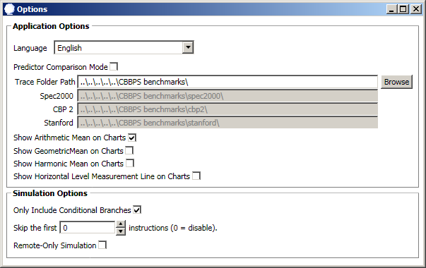
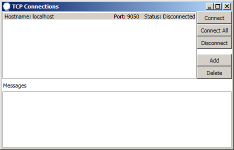
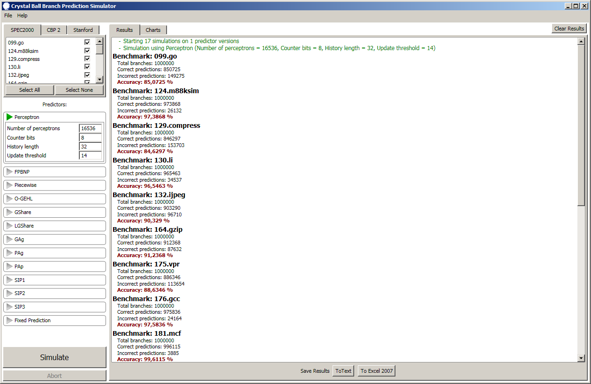
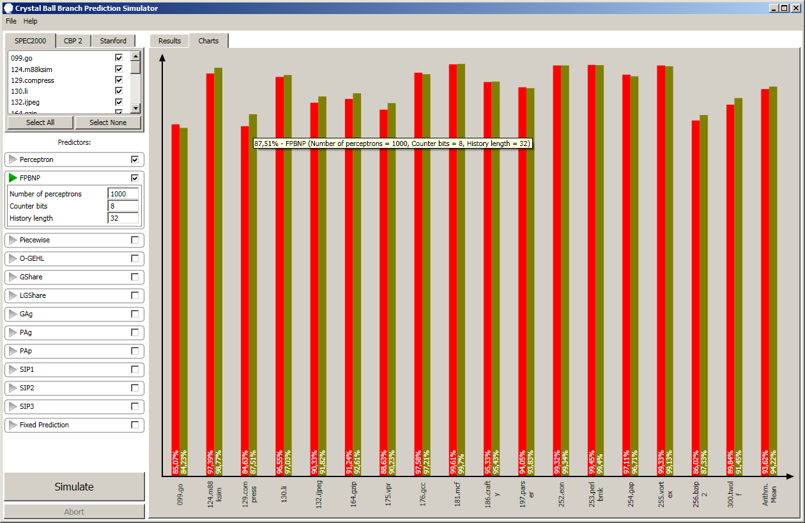

CBBPS - Crystal Ball Branch Prediction Simulator
===================================
Version 1.2 Released by [Alexandru Dorobanțiu](http://alex.dorobantiu.ro) and Andrei Marinică on 04.02.2018

### Branch prediction
See what branch prediction means and what it is used for on the [Wikipedia page](https://en.wikipedia.org/wiki/Branch_predictor)

### Features
- parallel and distributed branch prediction simulation
- simple Design Space Exploration through parameter combinatorics.
- plenty consecrated branch prediction algorithm implementations
- integration with three benchmark types
- results export in plain text or .xslx format

### Technology:
 - Written in plain **C#** using **Visual Studio 2010**
 - **.NET** framework, version **3.5**
 - The front-end is implemented using XAML
 
#### Details
The purpose of the project is to provide means of testing and comparison between different branch prediction algorithms. Another intended purpose is to provide example branch prediction algorithm implementations which are clean and do not have unnecessary and difficult to understand tweaks in order to fit into a memory budget or have low latencies for hardware feasibility.

The execution of the algorithms is managed independently of their implementation. If the predictors expose parameters, the GUI accepts comma separated values for them, and all combinations of parameters will be tested.

#### Implementation Details
Disclaimer: The initial version of the program was developed during the Computer Science classes while we were in university and the code was mostly organised in our coding standards back then (2010), which were not intended to be compatible with industry style coding. The coding and naming conventions are a mix between C# and Java style (in a good sense).

 - The main project is **BranchPredictionSimulator** which is a **Windows Application** using WPF (XAML).
 - The secondary project is **BranchPredictionSimulatorServer** which is a **Console Application** used for distributed processing over TCP/IP.
 - The **PredictionLogic** project contains common business logic for both client and server. It also contains all the benchmark readers and all the predictor implementations.
 - The **BZip2** project contains an implementation of the BZip2 algorithm useful for decompressing CBP2 traces, and was extracted as a separate project in order to give credit to the original author Mike Krueger in 2001. It also has a different licence (GPL) than the other projects, but it explicitly gives permission to use it without mandatory copyleft to the other projects.

##### Supported Benchmarks

 1) **Stanford** - small benchmark also in number of traces and number of branches per trace. It is the oldest of the three. I couldn't locate the exact origin of the trace files or the licence, but I will credit it for originating from here [https://benchmark.stanford.edu](https://benchmark.stanford.edu). If anybody else knows more, please email me about it.
 2) **SPEC 2000** - this in an excerpt with 1 million branches for each trace from the CPU2000 CINT 2000 traces, which is available at [http://hpca23.cse.tamu.edu/taco/public-bp/traces.gz](http://hpca23.cse.tamu.edu/taco/public-bp/traces.gz) (homepage of professor Daniel A. Jiménez). Details about the origin of the traces are available at [https://www.spec.org/cpu2000/CINT2000](https://www.spec.org/cpu2000/CINT2000)
 3) **CBP2** - Championship of Branch Prediction second edition - contains a large number of branches so simulations will take a longer time. It is the most recent benchmark implemented in this version of simulator. The entire championship infrastructure (which contains the traces) can be downloaded from [http://hpca23.cse.tamu.edu/taco/camino/cbp2/cbp2-infrastructure-v2.tar](http://hpca23.cse.tamu.edu/taco/camino/cbp2/cbp2-infrastructure-v2.tar) (also homepage of professor Daniel A. Jiménez)

More benchmarks can be added in the future.
 
##### Predictors
 - Fixed Predictor - always predict taken or not taken
 - SIP1 - Simple inertia predictor 1 - predicts taken or not taken based on a bias (disregards everything else)
 - SIP2 - Simple inertia predictor 2 - same as SIP1 but the bias is selected according to the branch address
 - SIP3 - Simple inertia predictor 3 - same as SIP2 but intertia of different magnitudes are kept and a perceptron-like algorithm decides which is better for a given branch
 - GAg - **G**lobal **A**daptive Branch Prediction using one **g**lobal pattern history table (see GAg, GAs, GAp, PAg, PAs, PAp, SAg, SAs family)
 - PAg - **P**er-address **A**daptive Branch Prediction using one **g**lobal pattern history table (see GAg, GAs, GAp, PAg, PAs, PAp, SAg, SAs family)
 - PAp - **P**er-address **A**daptive Branch Prediction using **p**er-address pattern history tables (see GAg, GAs, GAp, PAg, PAs, PAp, SAg, SAs family)
 - GShare - uses the address of the branch and global branch history XORed together
 - LGShare - uses the address of the branch and global branch history concatenated with local branch history XORed together
 - Perceptron - based on the [perceptron supervised binary classifier](https://en.wikipedia.org/wiki/Perceptron)
 - Fast Path-Based Neural Branch Predictor - perceptron learning rule applied on branch path (inspired from the [official implementation](http://hpca23.cse.tamu.edu/taco/public-bp/fpbnp.java) of Daniel A. Jiménez)
 - Idealized Piecewise Linear Branch Prediction - extended perceptron learning rule applied in both global history and branch path, implementation is based on [this paper](https://www.jilp.org/vol7/v7paper9.pdf)
 - OGEHL - Optimised GEometric History Length Branch Prediction - perceptron learning rule applied to geometric history length (hashed with branch address) table indexing, implementation is based on [this paper](https://www.jilp.org/vol7/v7paper7.pdf)
 
More predictors can be added in the future.

##### Notes
 - to be able to load the benchmarks, the path to them needs to be configured in the settings window:  
  
 - server settings which includes the path to benchmarks can be edited in the properties file "settings_server.ini" (it will be created after the first run if it doesn't exist)
 - connection with the server can be established through the TCP Connections window: 
 
 - to compare predictors, activate the option in the settings window
 - the execution is carried out on all the available system threads (maximizes CPU usage). This applies to both client and server applications.
 - the solution should be easy to migrate to newer Visual Studio environments without any changes.
 - the program does not come with an installation package (ready for execution).

##### Screenshots

 
[][CreativeCommonsLicence]
 
This work is licensed under a [Creative Commons Attribution-NonCommercial-ShareAlike 4.0 International License][CreativeCommonsLicence]

[CreativeCommonsLicence]: http://creativecommons.org/licenses/by-nc-sa/4.0/
 